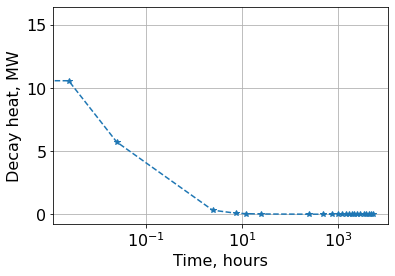
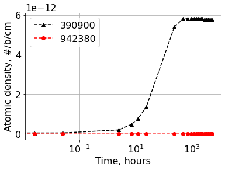

.. _decay_example:

Decay Case
==========

Description
-----------

Example on how to execute only decay (without transmutation)

Load modules
------------

.. code::  

    import numpy as np
    from pyIsoDep.functions.maindepletionsolver import MainDepletion
    from pyIsoDep.functions.generatedata import TransmutationData
    from pyIsoDep.functions.postprocessresults import Results

Decay data pre-generated in advance
~~~~~~~~~~~~~~~~~~~~~~~~~~~~~~~~~~~

.. code::  

    from pyIsoDep.tests.pregenerated_decay_isotopes import ID, N0,\
        timepoints, timeUnits, vol
    # Metadata is defined in the pre-generated file

Data Generation Stage
~~~~~~~~~~~~~~~~~~~~~

.. code::  

    # Reset the data container
    data = TransmutationData(libraryFlag=True, wgtFY=1.0)

Depletion Stage
~~~~~~~~~~~~~~~

Execute Decay
^^^^^^^^^^^^^

.. code::  

    dep = MainDepletion(0.0, data)
    # define metadata (steps, flux, and so on)
    dep.SetDepScenario(timeUnits=timeUnits, timepoints=timepoints)
    # set initial composition
    dep.SetInitialComposition(ID, N0, vol=vol)
    # solve the Bateman equations
    dep.SolveDecay(method="cram")

.. parsed-literal::

    No attribute <EfissMeV> in data
    No attribute <EfissJoule> in data
    No attribute <xsData> in data
    No attribute <transmutationmtx> in data
    

Post Decay analysis
^^^^^^^^^^^^^^^^^^^

.. code::  

    dep.DecayHeat()
    dep.Radiotoxicity()
    dep.Activity()
    dep.Mass()

Post-process results
~~~~~~~~~~~~~~~~~~~~

.. code::  

    res = Results(dep)

.. code::  

    res.getvalues("totalQt")

.. parsed-literal::

    array([1.56602539e+07, 1.05738584e+07, 5.72598936e+06, 3.19174204e+05,
           8.44793164e+04, 4.59066647e+04, 1.84245030e+04, 1.12211458e+03,
           5.01962241e+02, 3.13646011e+02, 2.19046147e+02, 1.63311340e+02,
           1.28306043e+02, 1.05206592e+02, 8.91708518e+01, 7.74417476e+01,
           6.84223791e+01, 5.51416437e+01, 4.54841730e+01, 3.79714447e+01,
           3.19441303e+01, 2.70438717e+01, 2.30363183e+01])

.. code::  

    res.plot("Nt", timeUnits="hours", markers=['--^', '--o'], isotopes=[531350, 541350],
             ylabel="Atomic density, #/b/cm", pltType="semilogx")

.. image:: decay_figs/decay_19_0.png

.. code::  

    res.plot("totalQt", timeUnits="hours", norm=1E+6, ylabel="Decay heat, MW", pltType="semilogx")

.. code::  

    res.plot("Nt", timeUnits="hours", markers=['--k^', '--ro'], isotopes=[390900, 942380],
             ylabel="Atomic density, #/b/cm", pltType="semilogx")

